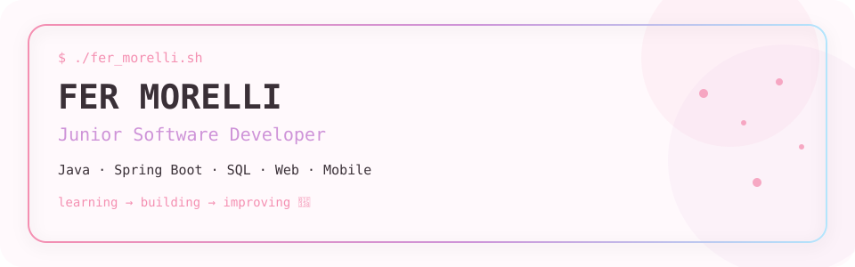
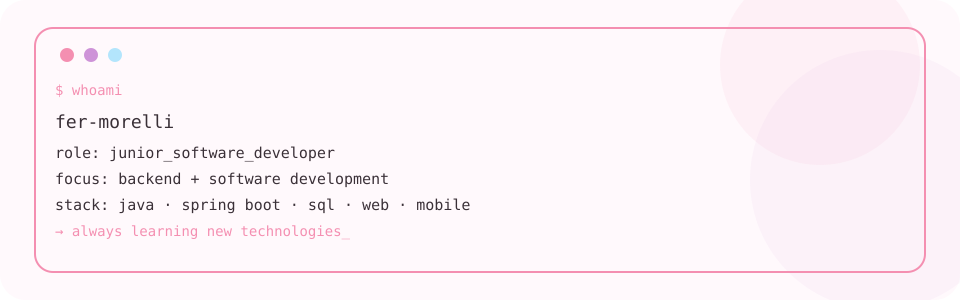
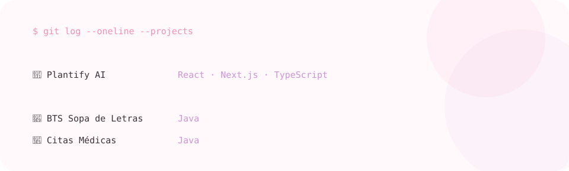
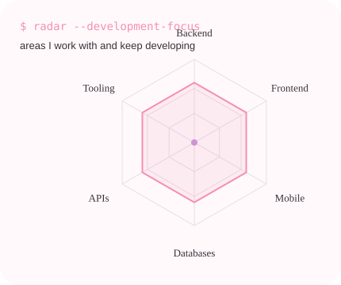
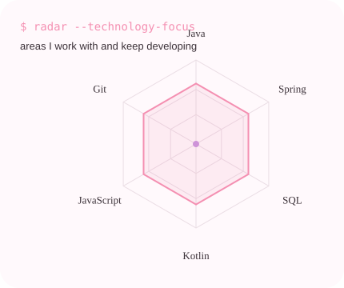

<div align="center">

<a href="https://github.com/FerMorell">
  <picture>
    <source media="(prefers-color-scheme: dark)" srcset="assets/banner-dark.svg">
    <source media="(prefers-color-scheme: light)" srcset="assets/banner-light.svg">
    
  </picture>
</a>

<br>

<a href="https://github.com/FerMorell">
  
</a>

<br>


</div>

---

## `$ whoami`

<p align="center">
  <picture>
    <source media="(prefers-color-scheme: dark)" srcset="assets/whoami-dark.svg">
    <source media="(prefers-color-scheme: light)" srcset="assets/whoami.svg">
    
  </picture>
</p>

---

<div align="center">

## `$ cat tech-stack.yaml`

<table>
<tr>

<td width="50%" valign="top" align="center">

<h3>☕ Backend</h3>

<br>


<br><br>

<code>Java · Spring Boot · PHP</code>

</td>

<td width="50%" valign="top" align="center">

<h3>🌐 Frontend</h3>

<br>


<br><br>

<code>HTML · CSS · JavaScript · React · Next.js</code>

</td>

</tr>

<tr>

<td width="50%" valign="top" align="center">

<h3>📱 Mobile</h3>

<br>


<br><br>

<code>Kotlin · Flutter · Dart</code>

</td>

<td width="50%" valign="top" align="center">

<h3>🗄️ Data & Tools</h3>

<br>


<br><br>

<code>SQL · Oracle · Git · GitHub · VS Code · IntelliJ</code>

</td>

</tr>
</table>

</div>

---

## `$ git log --projects`

<div align="center">

<picture>
  <source media="(prefers-color-scheme: dark)" srcset="assets/projects-dark.svg">
  <source media="(prefers-color-scheme: light)" srcset="assets/projects.svg">
  
</picture>

<br><br>

<a href="https://github.com/FerMorell/plantify-ai">
  
</a>

<a href="https://github.com/FerMorell/BTS-Sopa-de-letras">
  
</a>

<a href="https://github.com/FerMorell/CitasMedicas">
  
</a>

</div>

---

## `$ development --focus`

<p align="center">

  <picture>
    <source media="(prefers-color-scheme: dark)" srcset="assets/radar-dark.svg">
    <source media="(prefers-color-scheme: light)" srcset="assets/radar-light.svg">
    
  </picture>

  

  <picture>
    <source media="(prefers-color-scheme: dark)" srcset="assets/radar-tech-dark.svg">
    <source media="(prefers-color-scheme: light)" srcset="assets/radar-tech-light.svg">
    
  </picture>

</p>

<p align="center">
  <sub>
    <code>focus: backend · frontend · mobile · databases · APIs · continuous learning</code>
  </sub>
</p>

---

## `$ git status`

```text
On branch: learning

✓ building personal projects
✓ improving backend skills
✓ exploring frontend & mobile
✓ learning new technologies

status: curious
status: building
status: always improving 🌸
```

---

## `$ github --stats`

<p align="center">


</p>

---

## `$ connect --socials`

<div align="center">

<a href="mailto:morellifernanda02@gmail.com">
  
</a>

<a href="https://www.linkedin.com/in/fernanda-morelli/">
  
</a>

<a href="https://github.com/FerMorell">
  
</a>

</div>

<br>

<div align="center">

🌸 <b>Building things, learning things, becoming better every day.</b>

<br><br>

<sub>Made with 💗, code and a little cherry-blossom energy.</sub>

</div>
